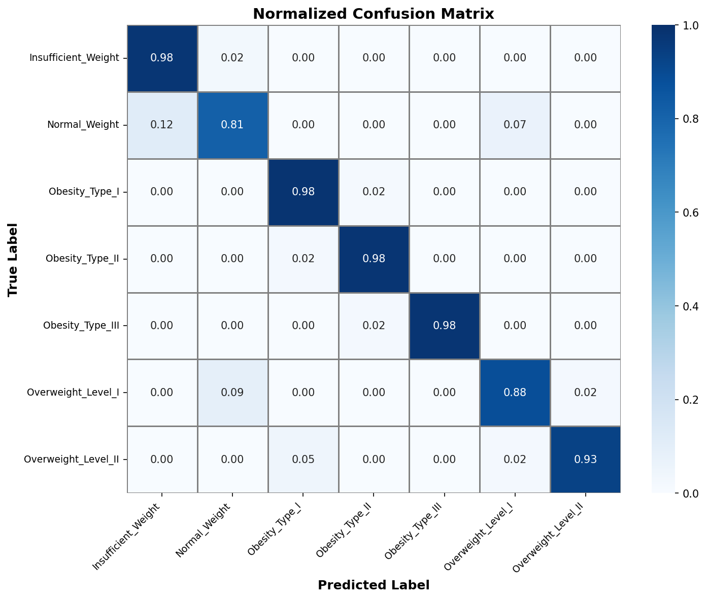
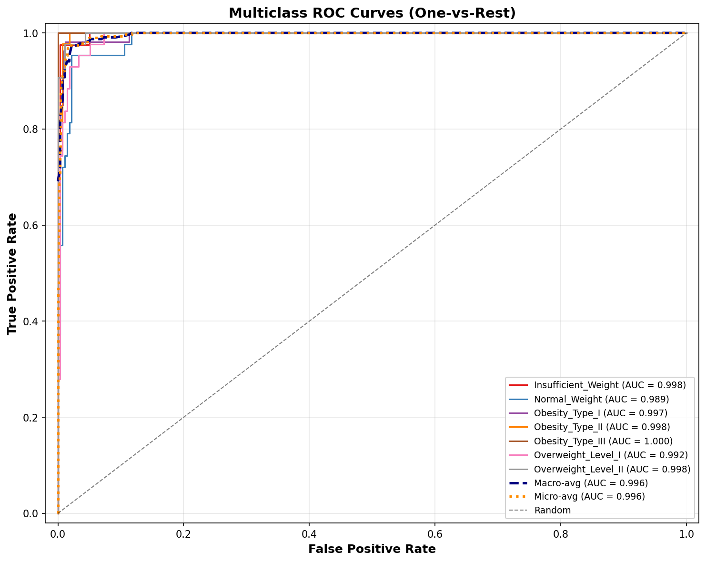
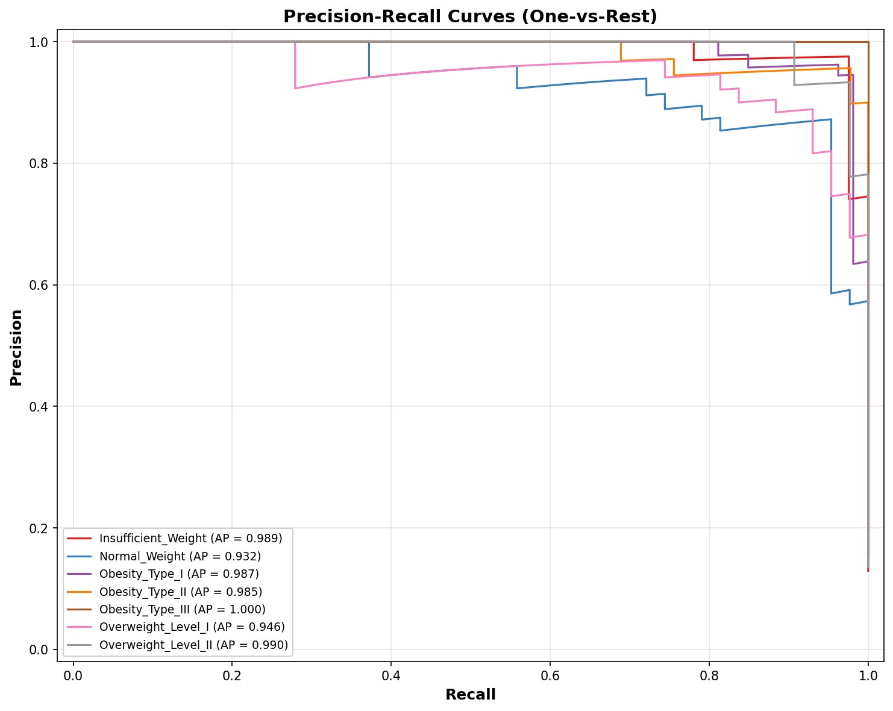
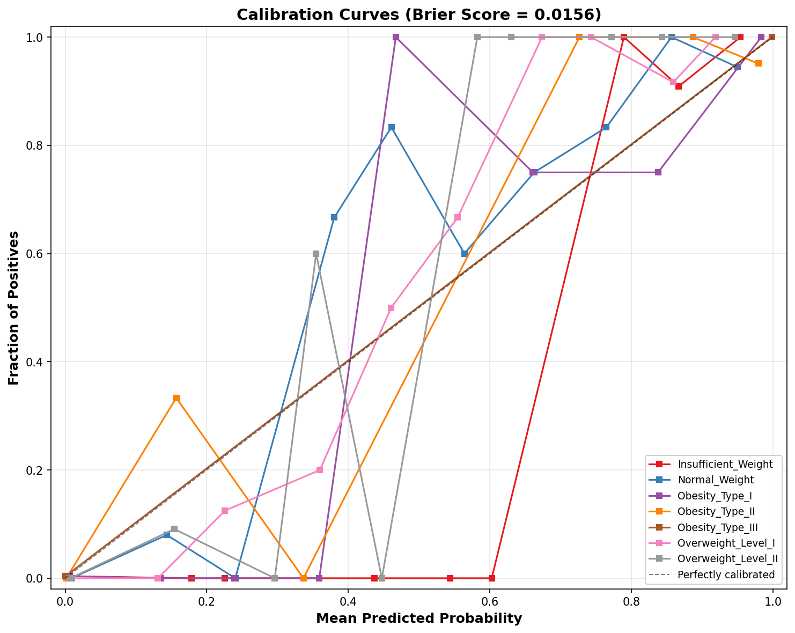

# Deep Learning Validation Report

## Scientific Validation of Neural Network for Obesity Classification

---

## 1. Executive Summary

This report presents the scientific validation of a Multi-Layer Perceptron (MLP) trained
for obesity classification using 7 classes from the UCI Obesity Dataset.
The model was validated on a held-out test set of 317 samples using multiple
complementary evaluation metrics and statistical tests.

### 1.1 Training Metrics (from Grid Search)

| Metric | Value |
|--------|-------|
| Test Accuracy | 0.9369 |
| Balanced Accuracy | 0.9346 |
| F1 Macro | 0.9343 |
| Precision Macro | 0.9352 |
| Recall Macro | 0.9346 |
| ROC-AUC OvR | 0.9959 |
| Test Samples | 317 |
| Num Classes | 7 |

## 2. Confusion Matrix Analysis

**Per-Class Recall:**

| Class | Recall |
|-------|--------|
| Insufficient_Weight | 0.9756 |
| Normal_Weight | 0.8140 |
| Obesity_Type_I | 0.9811 |
| Obesity_Type_II | 0.9778 |
| Obesity_Type_III | 0.9796 |
| Overweight_Level_I | 0.8837 |
| Overweight_Level_II | 0.9302 |

**Interpretation:** The normalized confusion matrix shows the classification performance
per class. Values on the diagonal represent correct classification rates (recall).
Off-diagonal elements indicate inter-class confusion patterns.

## 3. ROC Analysis (One-vs-Rest)

### 3.1 Per-Class AUC

| Class | AUC |
|-------|-----|
| Insufficient_Weight | 0.9981 |
| Normal_Weight | 0.9885 |
| Obesity_Type_I | 0.9966 |
| Obesity_Type_II | 0.9977 |
| Obesity_Type_III | 1.0000 |
| Overweight_Level_I | 0.9924 |
| Overweight_Level_II | 0.9982 |

- **Macro-average AUC:** 0.9962
- **Micro-average AUC:** 0.9963

**Interpretation:** AUC values above 0.9 indicate excellent discriminative ability.
The macro-average treats all classes equally; the micro-average weights by prevalence.

## 4. Precision-Recall Analysis

| Class | Avg Precision |
|-------|---------------|
| Insufficient_Weight | 0.9886 |
| Normal_Weight | 0.9323 |
| Obesity_Type_I | 0.9868 |
| Obesity_Type_II | 0.9851 |
| Obesity_Type_III | 1.0000 |
| Overweight_Level_I | 0.9461 |
| Overweight_Level_II | 0.9902 |

**Macro Avg Precision:** 0.9756

## 5. Calibration Analysis

**Brier Score (macro):** 0.015572

| Class | Brier Score |
|-------|-------------|
| Insufficient_Weight | 0.011977 |
| Normal_Weight | 0.029374 |
| Obesity_Type_I | 0.013080 |
| Obesity_Type_II | 0.009419 |
| Obesity_Type_III | 0.002976 |
| Overweight_Level_I | 0.026729 |
| Overweight_Level_II | 0.015451 |

**Interpretation:** The Brier Score measures probability calibration (lower is better).
Values close to 0 indicate well-calibrated probabilities. The calibration curve shows
how predicted probabilities align with observed frequencies.

## 6. Bootstrap Confidence Intervals (95%)

| Metric | Point Estimate | 95% CI Lower | 95% CI Upper | Std |
|--------|----------------|--------------|--------------|-----|
| accuracy | 0.9369 | 0.9085 | 0.9621 | 0.0134 |
| f1_macro | 0.9343 | 0.9050 | 0.9595 | 0.0139 |
| roc_auc_ovr | 0.9959 | 0.9931 | 0.9982 | 0.0013 |

**Interpretation:** Bootstrap confidence intervals provide non-parametric uncertainty
estimates. Narrow CIs indicate stable model performance.

## 7. Statistical Comparison: XGBoost vs Neural Network

| Test | Statistic | p-value | Interpretation |
|------|-----------|---------|----------------|
| Wilcoxon signed-rank | 1790.0 | 0.0 | Significant difference (p < 0.05) |
| McNemar | 12.190476 | 0.00048034 | Significant difference (p < 0.05) |
| DeLong (AUC diff) | -0.003788 | CI [-0.006436, -0.001639] | Significant ROC-AUC difference (CI excludes 0) |

**XGBoost Accuracy:** 0.9905
**XGBoost F1 Macro:** 0.9900
**Neural Network Accuracy:** 0.9369
**Neural Network F1 Macro:** 0.9343

### 7.1 McNemar Contingency Table

| | XGB Correct | XGB Wrong |
|---|---|---|
| **NN Correct** | 295 | 2 |
| **NN Wrong** | 19 | 1 |

## 8. Conclusions

### 8.1 Strengths

- Comprehensive multiclass evaluation using 7 complementary metrics
- Bootstrap confidence intervals for robust uncertainty quantification
- Direct statistical comparison with the production XGBoost model
- Calibration analysis ensuring reliable probability estimates
- Precision-Recall analysis for class-specific performance

### 8.2 Limitations

- MLP uses 11 features vs. XGBoost's 11 features (same feature set)
- Single train/test split (no cross-validation)
- Quick training with 3 configurations (full grid = 24)
- No hyperparameter tuning beyond grid search

### 8.3 Recommendations

1. Run full 24-configuration grid search for production deployment
2. Add 5x2 cross-validation for more robust comparison
3. Consider ensemble methods combining XGBoost + MLP predictions
4. Investigate calibration improvement via Platt scaling

---
*Report generated automatically by the Deep Learning Validation Pipeline*
*Date: 2026-07-14 09:13:56*